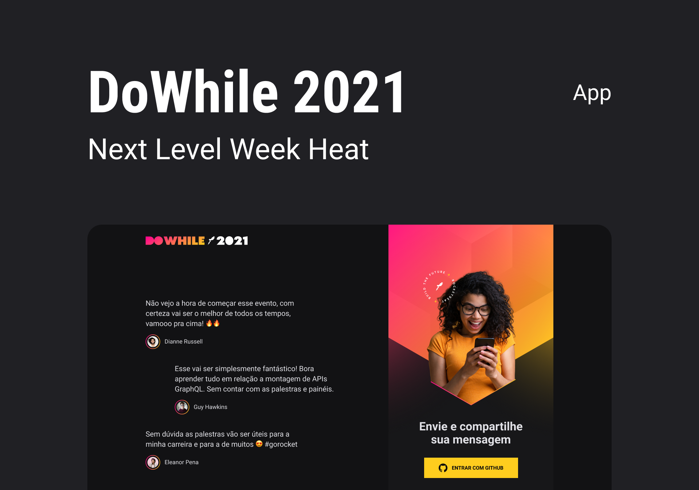

# Front-end Web DoWhile2021

  

## 🔖 Projeto

  Front-end Web da aplicação <b>DoWhile2021</b>, onde foi desenvolvido um chat em real-time desenvolvido com <b>React</b>, ela consome a API Node que você pode acessar o repositório da API através desse <a href="https://github.com/DouglasSoares16/node-api-dowhile2021" target="_blank">Link</a>.

 

## 💻 Layout da Aplicação

O <b>DoWhile2021</b> foi projetado pelo <b>Tiago Luchtenberg</b>. Você pode acessar o layout nesse <a href="https://www.figma.com/community/file/1031699316177416916/%5BNLW-Heat---Mission%3A-Impulse%5D-DoWhile2021" target="_blank">Link</a>

## 🚀 Technologies

* React
* Vite
* TypeScript
* Socket.io Client
* SASS
* Axios
